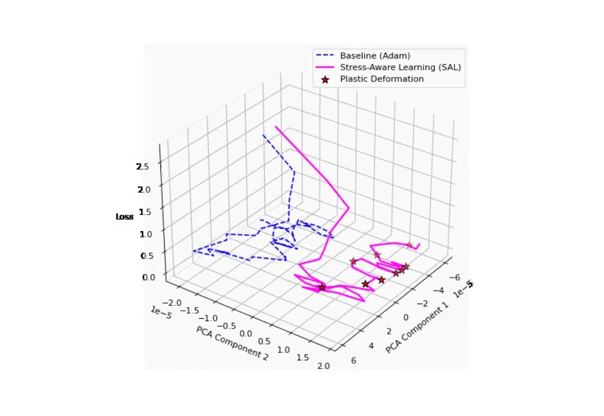
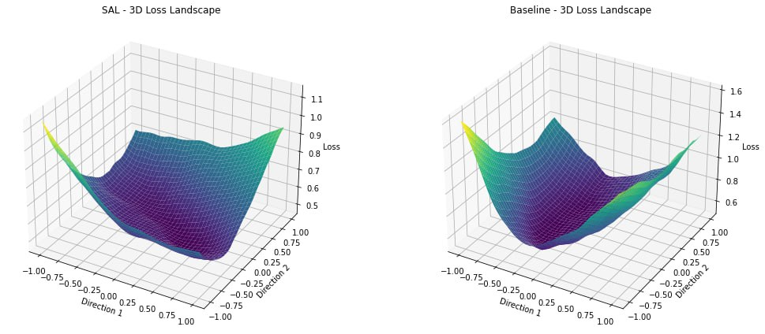
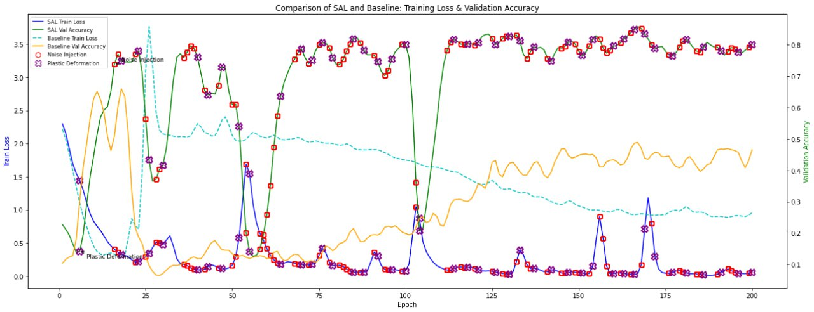

# SAL
Stress-Aware Resilient Neural Training

### 🎥 Demo: SAL
> 🔗 Click the images below to watch the 3D Visualizations with automatic playback.

There are additional images demonstrating how SAL affects the loss landscape in a 3D visualization mode and how it performs under uncertain training regimes.

